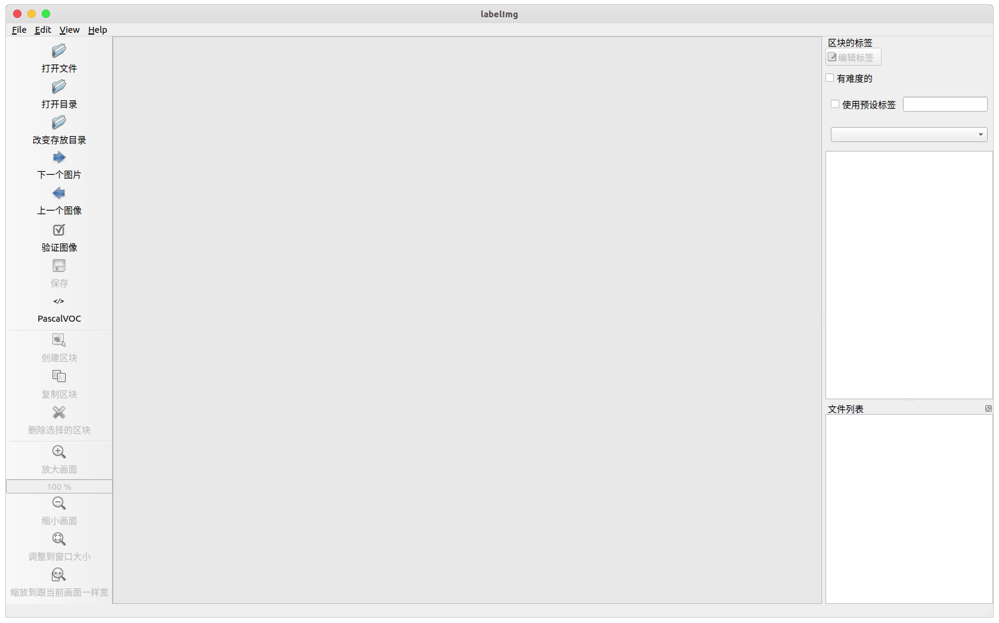
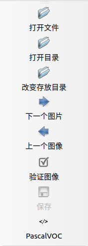
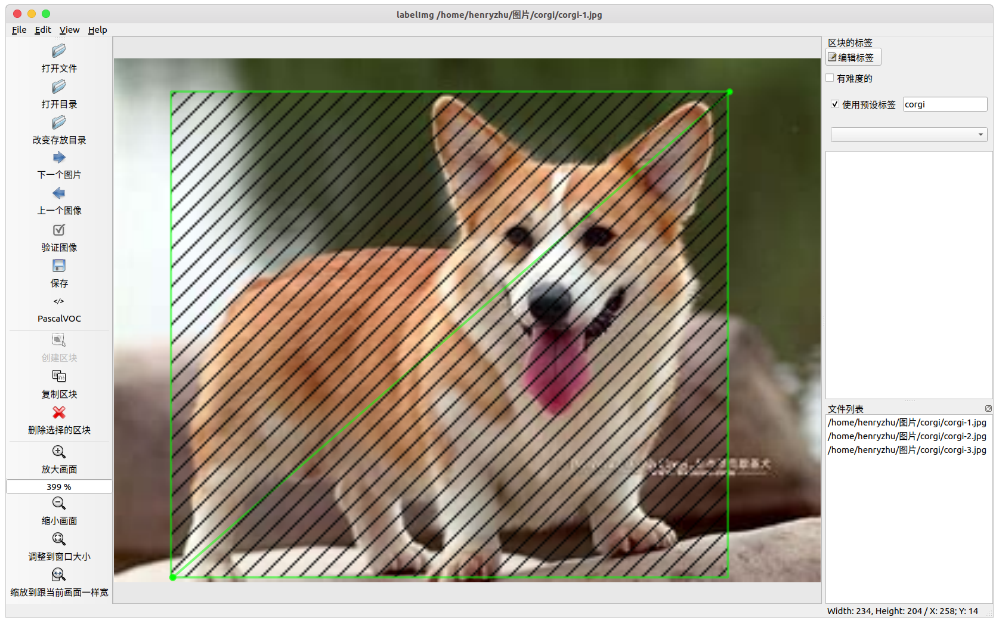
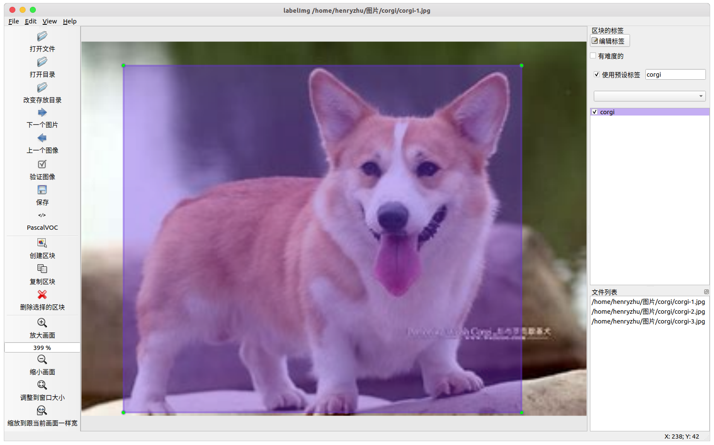

# 目录
- [目录](#目录)
- [数据集制作](#数据集制作)
  - [数据集的制作](#数据集的制作)
    - [1、收集数据集](#1收集数据集)
    - [2、数据集预处理](#2数据集预处理)
    - [3、格式化文件名](#3格式化文件名)
    - [制作成 VOC格式](#制作成-voc格式)
  - [图像标注](#图像标注)
    - [labelImg](#labelimg)
      - [labelImg 安装](#labelimg-安装)
      - [labelImg 使用](#labelimg-使用)
      - [labelImg 快捷键](#labelimg-快捷键)
- [开源数据集下载](#开源数据集下载)
  - [数据集库](#数据集库)
  - [图像数据集](#图像数据集)
  - [图片搜集的Google插件](#图片搜集的google插件)
  - [截图类似图片搜索的Google插件](#截图类似图片搜索的google插件)
  - [音频数据集](#音频数据集)

# 数据集制作

## 数据集的制作
**所有脚本请确保当前的目录是在 ``dataset-garbage/app> `` 下执行的，否则会出现找不到目录等情况**
```bash
├─dataset-garbage # 数据集文件夹
  ├─app           # 处理数据集的脚本，详情看 dataset-garbage/app/README.md
  ├─images        # 图片文件夹，图片存放在对应文件夹内
    ├─charge
    ├─fruit_apple
    └─vegetable_tomato
    ...
```

### 1、收集数据集
这一步，我们需要根据任务需求搜集对应的数据集，并放置在 ``dataset-garbage/images`` 目录下面，并且按照类别防止到对应文件夹下
```bash
├─dataset-garbage/images
  ├─charge
  ├─fruit_apple
  ├─fruit_pineapple
  ├─fruit_strawberry
  ├─vegetable_carrot
  ├─vegetable_mushroom
  ├─vegetable_potato
  └─vegetable_tomato
```
可以看到，目录的命名规则如上

### 2、数据集预处理
数据集需要进行压缩和降采样预处理
- 数据集的图片的大小不能超过 **500k** 。否则，整个完整的数据集大小会达到 GB 级以上


### 3、格式化文件名
执行重命名脚本。目录内全部文件会**按照目录名**进行重命名
```bash
python ./scripts/rename.py
```

- **重命名之后进行图像标注**，图像标注的过程详见 [labelImg 的使用](#图像标注)

---
### 制作成 VOC格式
制作过程由脚本自动完成

**VOC2012** 数据集描述：

- **Annotations**: 存放了数据`xml`格式存储的标签，里面包含了每张图片的`bounding box`信息，主要用于**目标检测**。
- **ImageSets**: ImageSets中的Segmentation目录下存放了用于分割的train, val, trainval数据集的索引。
- **JPEGImages**: 这里存放的就是JPG格式的原图，包含17125张彩色图片，但只有一部分(2913张)是用于分割的。
- **SegmentationClass**: 语义分割任务中用到的label图片，PNG格式，共2913张，与原图的每一张图片相对应。
- **SegmentationObject**: 实例分割任务用到的label图片，在语义分割中用不到，这里不详解介绍。

---

- 生成VOC格式的数据集空目录。在当前目录下，执行
```bash
python ./scripts/VOC-create.py
```
会在上层目录 `../` 中产生目录 `../VOC2012`

- 可以查看文件目录
```bash
tree ../VOC2012/
```


- 删除 `VOC2012` 数据集目录

```bash
python ./scripts/VOC-delete.py
```
> 为了防止误删除，在进行删除操作时会弹出提示框，输入 `delete` 确认删除 
> 
> ``input  delete/cancel  to finish the operate:``


- 标注完成后，数据集复制至 VOC 标准数据集中
```bash
python ./scripts/img-copyto-voc.py
```


- 生成类别文件 `classes.names` 和训练集文件 `train.txt` 、数据集文件 `val.txt`
```bash
python ./scripts/generate-txt.py
```

- VOC 数据集转换成 YOLO 数据集格式
```bash
python ./scripts/voc-to-yolo.py
```
- 得到 最终需要的文件


## 图像标注
### labelImg
<!-- https://blog.csdn.net/Dontla/article/details/102662815 -->

LabelImg 是图形图像注释工具。它是用 Python 编写的，并将 Qt 用于其图形界面。

批注以 **PASCAL VOC** 格式（ImageNet 使用的格式）另存为 `.xml` 文件。此外，它还支持 YOLO 格式

#### labelImg 安装
- Github 上的 [labelImg 源码](https://github.com/tzutalin/labelImg) 编译 (Python 3+pyQt5)

```bash
sudo apt-get install pyqt5-dev-tools
sudo pip3 install -r requirements/requirements-linux-python3.txt
make qt5py3

# start
python3 labelImg.py
python3 labelImg.py [IMAGE_PATH] [PRE-DEFINED CLASS FILE]
```
- pip安装 (推荐)
```bash
pip install labelImg

# start
labelImg
```
#### labelImg 使用
在 Ubuntu 下启动后的界面如下（Windows 版本可能略有差异）




- 打开文件 : 标注单张图像（不推荐使用）
- **打开目录** : 打开数据集存放的目录，目录下应该是图像的位置
- **改变存放目录**: 标注文件 `.xml` 存放的目录
- 下一个图片: 
- 上一个图像: 
- **验证图像**: 验证标记无误，用于全部数据集标记完成后的检查工作
- **保存**: 保存标记结果，快捷键 `Ctrl+s`
- **数据集格式**: `PascalVOC` 和 `YOLO` 可选，一般选择 `PascalVOC` 即可，需要 `YOLO` 可以之后进行转换

点击 `创建区块` 创建一个 矩形框，画出范围


每个类别都有对应的颜色加以区分


完成一张图片的标注后，点击 `下一个图片`

#### labelImg 快捷键

| 快捷键 |           功能           | 快捷键 |       功能       |
| :----: | :----------------------: | :----: | :--------------: |
| Ctrl+u |    从目录加载所有图像    |   w    |  创建一个矩形框  |
| Ctrl+R |   更改默认注释目标目录   |   d    |    下一张图片    |
| Ctrl+s |     保存当前标注结果     |   a    |    上一张图片    |
| Ctrl+d |   复制当前标签和矩形框   |  del   | 删除选定的矩形框 |
| space  |  将当前图像标记为已验证  | Ctrl+  |       放大       |
|  ↑→↓←  | 键盘箭头移动选定的矩形框 | Ctrl–  |       缩小       |


# 开源数据集下载

## 数据集库

- [Tianchi Data Sets](https://tianchi.aliyun.com/dataset): 阿里系唯一对外开放数据分享平台

## 图像数据集

- [MNIST](https://datahack.analyticsvidhya.com/contest/practice-problem-identify-the-digits/?spm=a2c6h.12873639.0.0.52b8f729Cs5pxU)： 50 MB; 手写数字数据集，包含一组 60,000 个示例的训练集和一个包含 10,000 个示例的测试集
- [MS-COCO](http://cocodataset.org/?spm=a2c6h.12873639.0.0.52b8f729Cs5pxU#home)： 25 GB（压缩）; 大型的、丰富的物体检测，分割和字幕数据集。330K 图像、80 个对象类别、每幅图像有 5 个标签、25 万个关键点
- [ImageNet](http://www.image-net.org/?spm=a2c6h.12873639.0.0.52b8f729Cs5pxU)： 150 GB; 是根据 WordNet 层次结构组织的图像数据集。WordNet 包含大约 100,000 个单词，ImageNet 平均提供了大约 1000 个图像来说明每个单词。
- [Open Images](https://github.com/openimages/dataset?spm=a2c6h.12873639.0.0.52b8f729Cs5pxU)： 500 GB（压缩）; 900 万张超过 5k 标签的图像。包含 9,011,219 张图像的训练集，41,260 张图像的验证集以及 125,436 张图像的测试集。
- [Fashion-MNIST](https://github.com/zalandoresearch/fashion-mnist?spm=a2c6h.12873639.0.0.52b8f729Cs5pxU)： 30 MB; 包含 60,000 个训练图像和 10,000 个测试图像，它是一个类似 MNIST 的时尚产品数据库。每张图片都以灰度显示，并与 10 个类别的标签相关联。
- [CIFAR-10](http://www.cs.toronto.edu/~kriz/cifar.html?spm=a2c6h.12873639.0.0.52b8f729Cs5pxU)： 170 MB; 是图像分类的另一个数据集，它由 10 个类的 60,000 个图像组成（每个类在上面的图像中表示为一行）。总共有 50,000 个训练图像和 10,000 个测试图像。

## 图片搜集的Google插件 

- 1、进入Chrome、Edge浏览器安装 [Fatkun(插件)](https://chrome.google.com/webstore/detail/fatkun-batch-download-ima/nnjjahlikiabnchcpehcpkdeckfgnohf?hl=zh-CN)

- 2、进入[Google Search](https://www.google.com/)搜索关键字
  

- 3、使用快捷键 `ALT+Z` 获取页面图片
-  4、选取完成后点击下载即可（注意关掉"是否下载”选项）
  


## 截图类似图片搜索的Google插件
- 1、进入Chrome、Edge浏览器安装 [Image Search Assistant](https://chrome.google.com/webstore/detail/image-search-assistant/kldhhobmmejaeaiilomaibhjlcfpceac)  
  
- 2、右键拓展（快捷键`CTRL+SHIFT+ALT+A`）截图待搜索图片  
  
  
- 3、此处百度图片会比较快和好用  
  
  
- 4、调用上步方法可以获得全部图片
  

## 音频数据集

- [免费音乐档案（FMA）](https://github.com/mdeff/fma?spm=a2c6h.12873639.0.0.52b8f729Cs5pxU)： 1000 GB; FMA 是音乐分析的数据集，该数据集由 full-length 和 HQ 音频、预先计算的特征以及音轨和用户级元数据组成。它是一个开放数据集，用于评估 MIR 中的几个任务。以下是数据集连同其包含的 csv 文件列表：
  - `tracks.csv`：106,574 首曲目的每首曲目元数据，如 ID，标题，艺术家，流派，标签和播放次数。
  - `genres.csv`：163 种风格的 ID 与他们的名字和父母（用于推断流派层次和顶级流派）。
  - `features.csv`：用 librosa 提取的共同特征 。
  - `echonest.csv`：由 Echonest （现在的 Spotify）为 13,129 首音轨的子集提供的音频功能 。
  - [学习从音频中识别音乐风格](https://arxiv.org/pdf/1803.05337.pdf?spm=a2c6h.12873639.0.0.52b8f729Cs5pxU&file=1803.05337.pdf)
- [城市声音分类](https://datahack.analyticsvidhya.com/contest/practice-problem-urban-sound-classification/?spm=a2c6h.12873639.0.0.52b8f729Cs5pxU)： 训练集 3 GB, 测试集2 GB（压缩）; 包含超过 8000 个来自 10 个不同城市声音摘录。这个实践问题旨在向你介绍常见分类方案中的音频处理。
